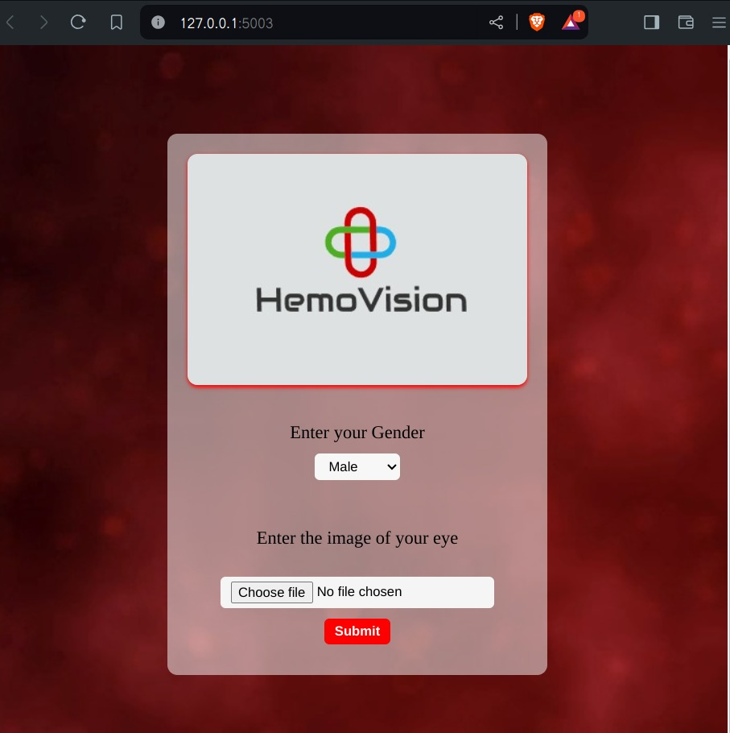
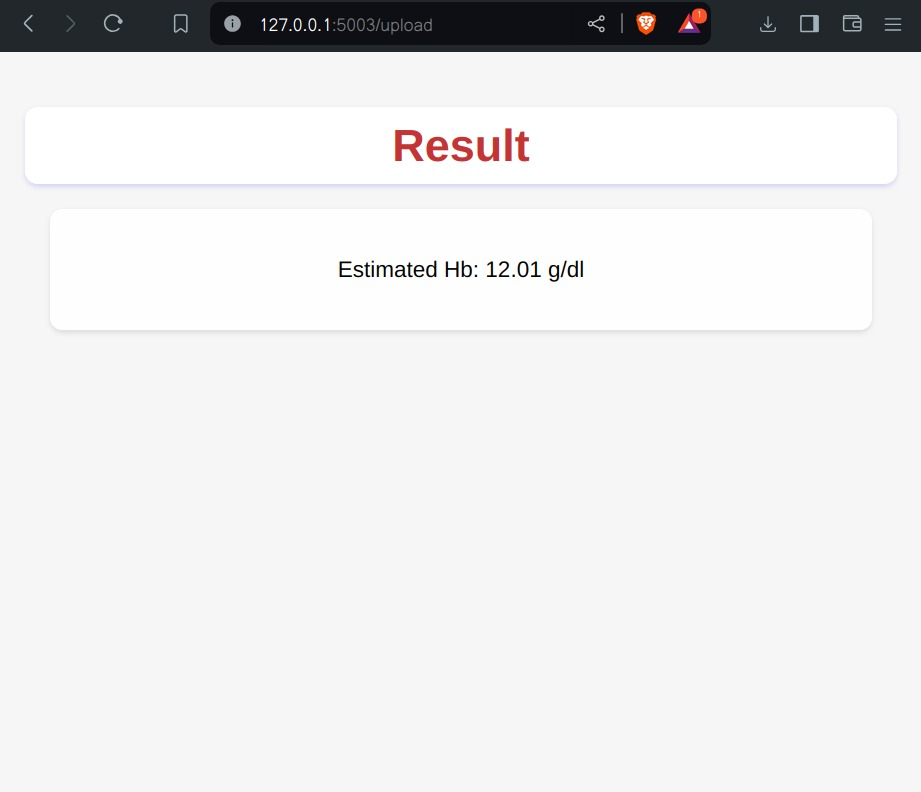
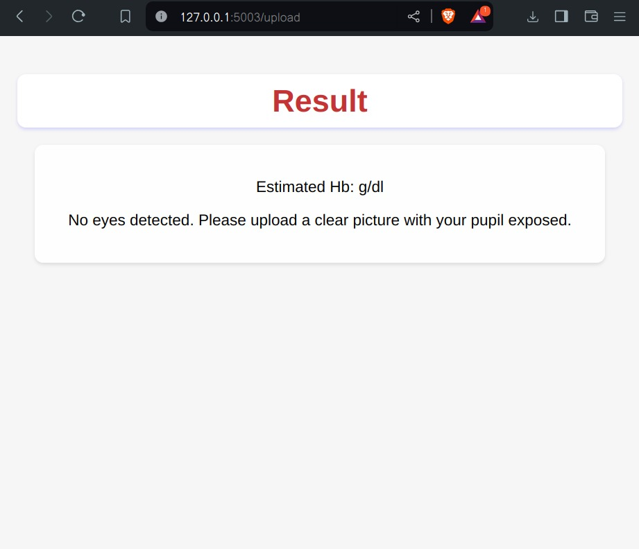
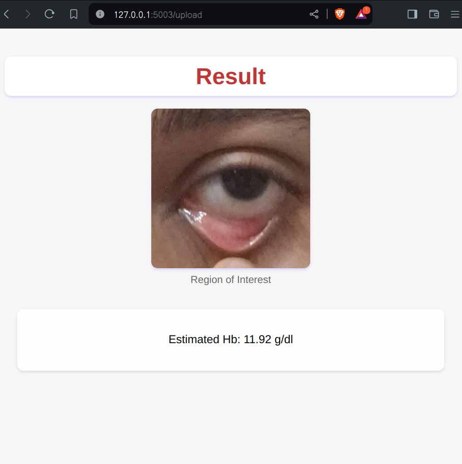

Here's your updated README with a 2x2 grid format for the images:  

---

# HemaVision - Eye-Based Hemoglobin Estimation

HemaVision is a web-based application that estimates hemoglobin levels from an eye image using OpenCV and Flask.

## Features
- Upload an eye image for hemoglobin estimation.
- Image processing using OpenCV.
- Interactive UI with real-time results.
- Flask-based backend for image handling.

## Installation
1. Clone this repository:
   ```sh
   git clone https://github.com/your-username/HemaVision.git
   cd HemaVision
   ```
2. Install dependencies:
   ```sh
   pip install -r requirements.txt
   ```
3. Run the application:
   ```sh
   python app.py
   ```
4. Open your browser and go to `http://127.0.0.1:5000/`

## Screenshots  
Here are some screenshots of the web app:  

|  |  |  
|--------------------------------|--------------------------------|  
|  |  |  

## Project Structure
```
HemaVision/
│── static/
│   ├── HemaVisionLogo.jpg
│   ├── slicebg.mp4
│   ├── ROI_1.jpg
│   ├── ROI_Reduced.jpg
│── templates/
│   ├── index.html
│   ├── result.html
│── app.py
│── requirements.txt
│── README.md
```

## License
This project is licensed under the MIT License.

---

Let me know if you'd like to tweak anything! 🚀
